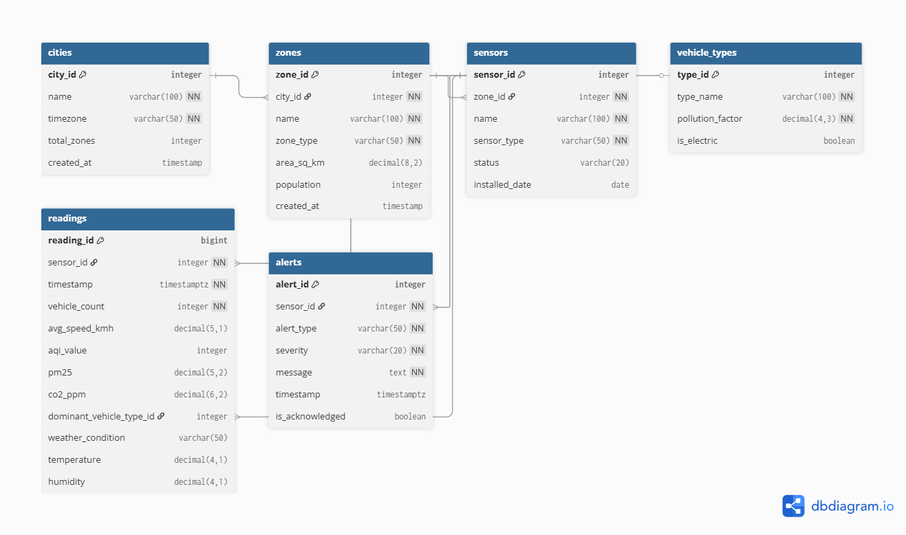

# AQI & Traffic Data Processing System using PERN

A comprehensive urban analytics platform built using the PERN (PostgreSQL, Express.js, React.js, Node.js) stack. This application allows users to monitor 
real-time air quality (AQI), track traffic patterns, and view localized environmental data seamlessly. 
## Features

- **User Authentication:** Secure authentication using JWT (JSON Web Tokens).
- **Real-Time Data Dashboard** View core metrics (AQI, traffic density, Pollutant levels) for specific cities, zones, and timeframes, with data fetched from a PostgreSQL database.
- **Location & Zone Filtering** Filter data by specific city, neighborhood, or zone type (e.g., industrial, residential, commercial) to get hyper-local insights.
- **Personalized Alerts** Users can subscribe to receive notifications when AQI or traffic levels in their saved locations exceed predefined thresholds.

## Technologies Used

- **Frontend:** React.js, React Router.
- **Backend:** Node.js, Express.js, PostgresSQL.
- **Authentication:** JWT (JSON Web Tokens).



## Getting Started

To get a local copy up and running follow these simple steps.

### Prerequisites

- Node.js installed on your machine with latest version or v22.2.0 above
- PostgresSQL account or local server.

### Installation

1. Clone the repo:
   ```sh
   git clone https://github.com/Varuncc891/AQI-Dashboard.git
   ```
2. Install NPM packages:

   ```sh
   cd AQI-Dashboard
   cd backend
   npm install
   cd..
   cd frontend
   npm install
   ```

3. ## If you don't want to change the`.env` credentials skip step 4 and move to step 5.

4. Set up environment variables:

   - Create a `config.env` file after creating a `config folder` in the backend directory, containing the following variables:

   ```env
   DB_HOST=
   DB_PORT=
   DB_NAME=
   DB_USER=
   DB_PASSWORD=
   JWT_SECRET=
   SERVER_PORT=
   ```

   Replace each value with your specific configuration details.

5. Run the application backend (make sure you are in `/backend` directory) :

   ```sh
   node server.js
   ```

6. Run the application frontend (make sure you are in `/frontend` directory) :
   ```sh
   npm run dev
   ```
7. Open your browser and navigate to `http://localhost:5173` to view the app.


